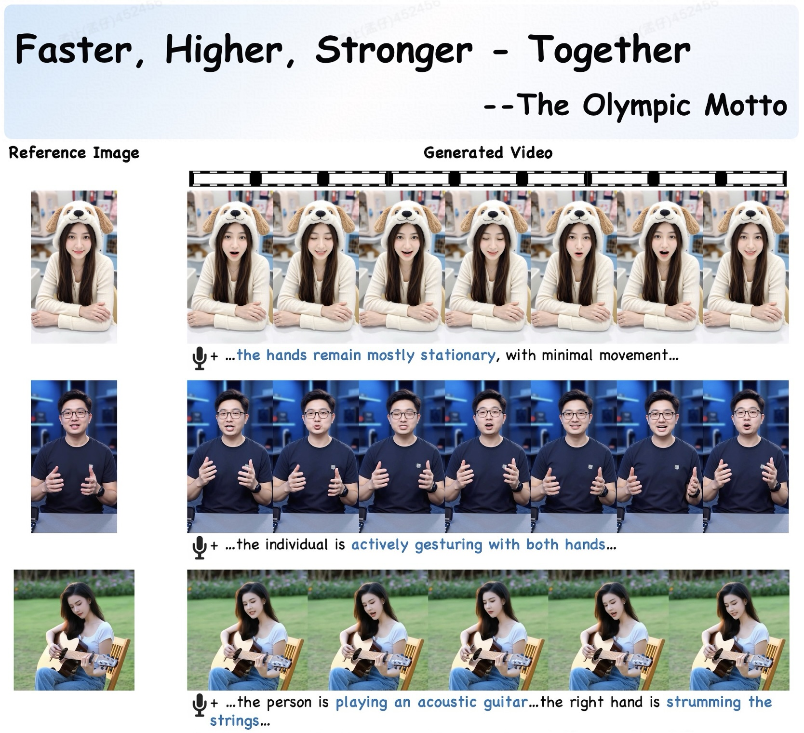

[简体中文](https://github.com/antgroup/echomimic_v3/blob/main/README_zh.md) | English 
<p align="center">
  
</p>

<h1 align='center'>EchoMimicV3: 1.3B Parameters are All You Need for Unified Multi-Modal and Multi-Task Human Animation</h1>

<div align='center'>
    <a href='https://github.com/mengrang' target='_blank'>Rang Meng</a><sup>1</sup>&emsp;
    <a href='https://github.com/' target='_blank'>Yan Wang</a>&emsp;
    <a href='https://github.com/' target='_blank'>Weipeng Wu</a>&emsp;
    <a href='https://github.com/' target='_blank'>Ruobing Zheng</a>&emsp;
    <a href='https://lymhust.github.io/' target='_blank'>Yuming Li</a><sup>2</sup>&emsp;
    <a href='https://openreview.net/profile?id=~Chenguang_Ma3' target='_blank'>Chenguang Ma</a><sup>2</sup>
</div>
<div align='center'>
Terminal Technology Department, Alipay, Ant Group.
</div>
<p align='center'>
    <sup>1</sup>Core Contributor&emsp;
    <sup>2</sup>Corresponding Authors
</p>
<div align='center'>
    <a href='https://github.com/antgroup/echomimic_v3'></a>
    <a href='https://antgroup.github.io/ai/echomimic_v3/'></a>
    <a href='https://arxiv.org/abs/2507.03905'></a>
    <a href='https://huggingface.co/BadToBest/EchoMimicV3'></a>
    <a href='https://modelscope.cn/models/BadToBest/EchoMimicV3'></a>
    <a href='https://github.com/antgroup/echomimic_v3/blob/main/asset/wechat_group.png'></a>
    <a href='https://github.com/antgroup/echomimic_v3/discussions/18'></a>
    <!--<a href='https://antgroup.github.io/ai/echomimic_v2/'></a>-->
    <!--<a href='https://antgroup.github.io/ai/echomimic_v2/'></a>-->
    <!-- <a href='https://openaccess.thecvf.com/content/CVPR2025/papers/Meng_EchoMimicV2_Towards_Striking_Simplified_and_Semi-Body_Human_Animation_CVPR_2025_paper.pdf'></a> -->
  
</div>
<!-- <div align='center'>
    <a href='https://github.com/antgroup/echomimic_v3/discussions/0'></a>
    <a href='https://github.com/antgroup/echomimic_v3/discussions/1'></a>
</div> -->

<p align="center">
  
</p>

## &#x1F4E3; Updates
* [2025.08.21] 🔥 EchoMimicV3 gradio demo on [modelscope](https://modelscope.cn/studios/BadToBest/EchoMimicV3) is ready.
* [2025.08.12] 🔥🚀 **12G VRAM is All YOU NEED to Generate Video**. Please use this [GradioUI](https://github.com/antgroup/echomimic_v3/blob/main/app_mm.py). Check the [tutorial](https://www.bilibili.com/video/BV1W8tdzEEVN) from @[gluttony-10](https://github.com/gluttony-10). Thanks for the contribution.
* [2025.08.12] 🔥 EchoMimicV3 can run on **16G VRAM** using [ComfyUI](https://github.com/smthemex/ComfyUI_EchoMimic). Thanks @[smthemex](https://github.com/smthemex) for the contribution.
* [2025.08.09] 🔥 We release our [models](https://modelscope.cn/models/BadToBest/EchoMimicV3) on ModelScope.
* [2025.08.08] 🔥 We release our [codes](https://github.com/antgroup/echomimic_v3) on GitHub and [models](https://huggingface.co/BadToBest/EchoMimicV3) on Huggingface.
* [2025.07.08] 🔥 Our [paper](https://arxiv.org/abs/2507.03905) is in public on arxiv.

## &#x1F305; Gallery
<p align="center">
  
</p>
<table class="center">
<tr>
    <td width=100% style="border: none">
        <video controls loop src="https://github.com/user-attachments/assets/f33edb30-66b1-484b-8be0-a5df20a44f3b" muted="false"></video>
    </td>
</tr>
<tr>
    <td width=100% style="border: none">
        <video controls loop src="https://github.com/user-attachments/assets/056105d8-47cd-4a78-8ec2-328ceaf95a5a" muted="false"></video>
    </td>
</tr>
</table>

### Chinese Driven Audio
<table class="center">
<tr>
    <td width=25% style="border: none">
        <video controls loop src="https://github.com/user-attachments/assets/fc1ebae4-b571-43eb-a13a-7d6d05b74082" muted="false"></video>
    </td>
    <td width=25% style="border: none">
        <video controls loop src="https://github.com/user-attachments/assets/54607cc7-944c-4529-9bef-715862ba330d" muted="false"></video>
    </td>
    <td width=25% style="border: none">
        <video controls loop src="https://github.com/user-attachments/assets/4d1de999-cce2-47ab-89ed-f2fa11c838fe" muted="false"></video>
    </td>
    <td width=25% style="border: none">
        <video controls loop src="https://github.com/user-attachments/assets/41e701cc-ac3e-4dd8-b94c-859261f17344" muted="false"></video>
    </td>
</tr>
</table>

For more demo videos, please refer to the [project page](https://antgroup.github.io/ai/echomimic_v3/)

## Quick Start
### Environment Setup
- Tested System Environment: Centos 7.2/Ubuntu 22.04, Cuda >= 12.1
- Tested GPUs: A100(80G) / RTX4090D (24G) / V100(16G)
- Tested Python Version: 3.10 / 3.11
- 
### 🛠️Installation for Windows

##### Please use the [one-click installation package](https://pan.baidu.com/share/init?surl=cV7i2V0wF4exDtKjJrAUeA) (passport: glut) to get started quickly for Quantified version.

### 🛠️Installation for Linux
#### 1. Create a conda environment
```
conda create -n echomimic_v3 python=3.10
conda activate echomimic_v3
```

#### 2. Other dependencies
```
pip install -r requirements.txt
```
### 🧱Model Preparation

| Models        |                       Download Link                                           |    Notes                      |
| --------------|-------------------------------------------------------------------------------|-------------------------------|
| Wan2.1-Fun-V1.1-1.3B-InP  |      🤗 [Huggingface](https://huggingface.co/alibaba-pai/Wan2.1-Fun-V1.1-1.3B-InP)       | Base model
| wav2vec2-base |      🤗 [Huggingface](https://huggingface.co/facebook/wav2vec2-base-960h)          | Audio encoder
| EchoMimicV3-preview      |      🤗 [Huggingface](https://huggingface.co/BadToBest/EchoMimicV3)              | Our weights
| EchoMimicV3-preview      |      🤗 [ModelScope](https://modelscope.cn/models/BadToBest/EchoMimicV3)              | Our weights

-- The **weights** is organized as follows.

```
./models/
├── Wan2.1-Fun-V1.1-1.3B-InP
├── wav2vec2-base-960h
└── transformer
    └── diffusion_pytorch_model.safetensors
``` 
### 🔑 Quick Inference
```
python infer.py
```
For Quantified GradioUI version:
```
python app_mm.py
```
**images, audios, masks and prompts are provided in `datasets/echomimicv3_demos`**

#### Tips
> - Audio CFG: Audio CFG `audio_guidance_scale` works optimally between 2~3. Increase the audio CFG value for better lip synchronization, while decreasing the audio CFG value can improve the visual quality.
> - Text CFG: Text CFG `guidance_scale` works optimally between 3~6. Increase the text CFG value for better prompt following, while decreasing the text CFG value can improve the visual quality.
> - TeaCache: The optimal range for `teacache_threshold` is between 0~0.1.
> - Sampling steps: 5 steps for talking head, 15~25 steps for talking body. 
> - ​Long video generation: If you want to generate a video longer than 138 frames, you can use Long Video CFG.
> - Try setting `partial_video_length` to 81, 65 or smaller to reduce VRAM usage.


## 📝 TODO List
| Status | Milestone                                                                |     
|:--------:|:-------------------------------------------------------------------------|
|    ✅    | The inference code of EchoMimicV3 meet everyone on GitHub   | 
|    ✅   | EchoMimicV3-preview model on HuggingFace | 
|    ✅   | EchoMimicV3-preview model on ModelScope | 
|    ✅  | ModelScope Space | 
|    🚀    | 720P Pretrained models | 
|    🚀    | The training code of EchoMimicV3 meet everyone on GitHub   | 


## &#x1F680; EchoMimic Series
* EchoMimicV3: 1.3B Parameters are All You Need for Unified Multi-Modal and Multi-Task Human Animation. [GitHub](https://github.com/antgroup/echomimic_v3)
* EchoMimicV2: Towards Striking, Simplified, and Semi-Body Human Animation. [GitHub](https://github.com/antgroup/echomimic_v2)
* EchoMimicV1: Lifelike Audio-Driven Portrait Animations through Editable Landmark Conditioning. [GitHub](https://github.com/antgroup/echomimic)

## &#x1F4D2; Citation

If you find our work useful for your research, please consider citing the paper :

```
@misc{meng2025echomimicv3,
  title={EchoMimicV3: 1.3B Parameters are All You Need for Unified Multi-Modal and Multi-Task Human Animation},
  author={Rang Meng, Yan Wang, Weipeng Wu, Ruobing Zheng, Yuming Li, Chenguang Ma},
  year={2025},
  eprint={2507.03905},
  archivePrefix={arXiv}
}
```
## Reference
- Wan2.1: https://github.com/Wan-Video/Wan2.1/
- VideoX-Fun: https://github.com/aigc-apps/VideoX-Fun/
## 📜 License
The models in this repository are licensed under the Apache 2.0 License. We claim no rights over the your generated contents, 
granting you the freedom to use them while ensuring that your usage complies with the provisions of this license. 
You are fully accountable for your use of the models, which must not involve sharing any content that violates applicable laws, 
causes harm to individuals or groups, disseminates personal information intended for harm, spreads misinformation, or targets vulnerable populations. 


## &#x1F31F; Star History
[](https://www.star-history.com/#antgroup/echomimic_v3&Date)


